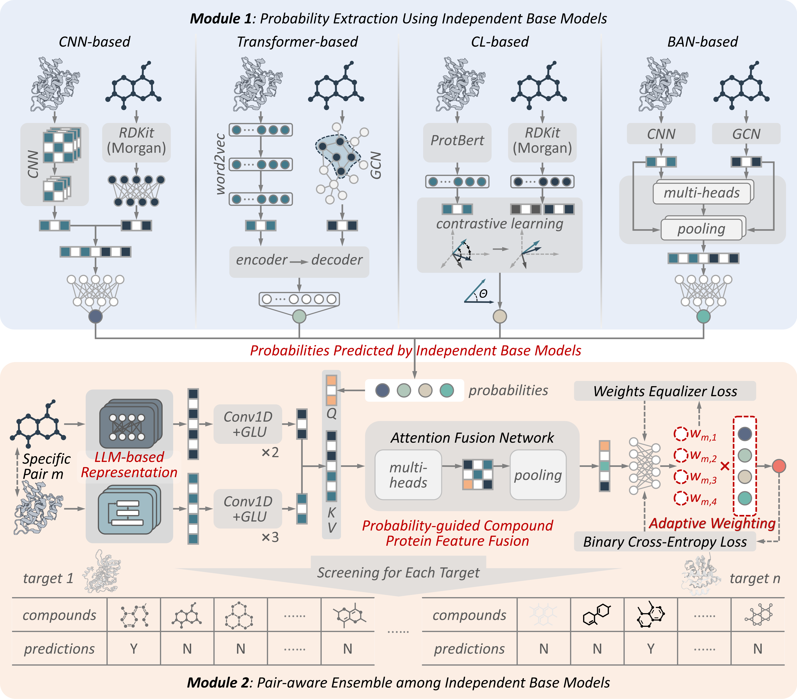

# AdaptiveHIT: Pair-Aware Ensemble Framework for Novel Hit Identification

**AdaptiveHIT** is a pair-aware ensemble framework that adaptively integrates predictions from diverse base models by leveraging their complementary strengths while mitigating individual biases in novel hit identification. Benchmark evaluations demonstrated that this framework outperforms all base models across most scenarios, particularly in identifying bioactive molecules with novel scaffolds. Interpretability analyses further revealed that AdaptiveHIT achieves substantially much higher precision in recognizing ligand binding sites and hot-spot residues.



---

# Workflow & Quick Start

## Installation

```bash
git clone --recurse-submodules <this-repo-url>
cd AdaptiveHIT
bash run.sh
conda activate adaptivehit
```

`run.sh` sets up everything in one pass: the main `adaptivehit` env (`environment.yml`, for `meta_learner/`+`data_adapter/`) plus one env per `base_model/*` submodule (`conplex`, `transformerCPI`, `DeepConv-DTI`, `drugban`), using each submodule's own documented dependencies -- DeepConv-DTI needs a legacy TensorFlow-1/Keras stack while the other three are PyTorch-based, so they're kept fully separate and never imported into `adaptivehit`, only invoked as separate processes via `pipeline/*.sh`. It's idempotent (safe to re-run, skips envs that already exist); if a given base model's env fails to solve (a few pin old CUDA/package versions from their original 2019-2023 releases), see the comments in `run.sh` or that submodule's own `README.md` and adjust by hand.

---

## Quickstart (toy dataset, zero configuration)

Try this first: it runs end-to-end against the shipped `data/toy_dataset/` with every path already concrete, nothing to fill in. This runs the actual AdaptiveHIT model -- probability-guided attention fusion over the four base models' logits plus ESM-2/X-Mol representations (the architecture in the figure above) -- not a fixed-weight ensembling baseline. It needs ESM-2 protein + X-Mol drug embeddings first:
```bash
python data_adapter/generate_esm2_embeddings.py \
    --prots_csv data/toy_dataset/id/toy_dataset_prots.csv \
    --datatype toy_dataset --output_dir data/embeddings/esm2_t36_3B_UR50D

python data_adapter/xmol_embed.py \
    --drugs_csv data/toy_dataset/id/toy_dataset_drugs.csv \
    --datatype toy_dataset --output_dir data/embeddings/xmol
python data_adapter/prebuild_xmol_cache.py data/toy_dataset toy_dataset data/embeddings/xmol

python meta_learner/predict.py \
    --input_dir data/toy_dataset/end_merged \
    --output_dir /tmp/adaptivehit_out \
    --data_subdir toy_dataset \
    --protein_emb_dir data/embeddings/esm2_t36_3B_UR50D \
    --drug_emb_dir data/embeddings/xmol \
    --eval
```
`--model_dir` defaults to the shipped pretrained checkpoint (`checkpoints/meta/meta_full_esm2_xmol_prob_attention/`). **`--protein_emb_dir`/`--drug_emb_dir` are not actually optional despite `meta_config.py` defining repo-relative defaults for them** -- the shipped checkpoint's own saved config carries the original training cluster's absolute paths (e.g. `/public/home/lixy/.../xmol_shared/...`), and `predict.py` only overrides those with the computed defaults when the flags are passed explicitly. Omitting them fails with `FileNotFoundError: Global feature library not found: /public/home/...` (verified by actually running it against a fresh clone). `esm2_t36_3B_UR50D` is a 3B-parameter model (~5.4GB, downloaded once and cached by `fair-esm`) -- `torch.hub`'s download isn't resumable, so a network interruption mid-download leaves a corrupt cache file at `~/.cache/torch/hub/checkpoints/esm2_t36_3B_UR50D.pt` that must be deleted before retrying (`generate_esm2_embeddings.py` doesn't currently validate/clean this up itself). On an unreliable connection, download it with a tool that *can* resume instead and let `fair-esm` find it already cached:
```bash
curl -fL -C - -o ~/.cache/torch/hub/checkpoints/esm2_t36_3B_UR50D.pt \
    https://dl.fbaipublicfiles.com/fair-esm/models/esm2_t36_3B_UR50D.pt
```
(verified end-to-end: full pipeline run against real, not zero-tensor-placeholder, ESM-2 embeddings)

---

## Running AdaptiveHIT on Your Own Data (Optional)

**Target users:** researchers who want predictions on their own compound-protein pairs, or who want to retrain the base models / MetaLearner from scratch, rather than just reproducing the toy-dataset walkthrough above. This is the only part of the workflow where you must supply your own paths, since these are inherently your own dataset and checkpoints -- everywhere else in this README already resolves to a concrete path.

All commands below assume you're in the repo root, so `model_env_dir`/`base_model_dir` arguments are just `$(pwd)`/`$(pwd)/base_model/<Name>`.

**0.1 Run the 4 base models' predictions**, using the shipped pretrained checkpoints on your own test set (`<testset_dir>`, expected to contain `<testset_dir>/data/*.csv` or `*.txt` per base model -- see each script's own `find` pattern):
```bash
pipeline/predict/integ_screen_conplex_predict.sh \
    checkpoints/base_models/model-0.0005-64-0.1-conplex-858.model '' <testset_dir> base_model/ConPLex_dev
pipeline/predict/integ_screen_drugban_predict.sh \
    checkpoints/base_models/model-0.0005-64-0.1-drugban-940.model '' <testset_dir> base_model/DrugBAN
pipeline/predict/integ_screen_trans_predict.sh \
    checkpoints/base_models/model-0.0005-128-0.1-trans-946.model '' <testset_dir> base_model/TransformerCPI
pipeline/predict/integ_screen_deep_predict.sh \
    checkpoints/base_models/model-0.0005-64-0.1-deep-969.model '' <testset_dir> base_model/DeepConv-DTI
```
(second argument is the CUDA device id; `''` runs on CPU). Or run the full orchestration in one call: `pipeline/meta_train.sh $(pwd)` (training-time) / `pipeline/meta_predict.sh $(pwd)` (inference-time) -- both are internal cluster-authored scripts with more hardcoded assumptions than the ones above, so expect to read/adjust them before use.

**0.2 Generate embeddings** for your own compound/protein CSVs, same two commands as the Quickstart above but pointed at your own `--prots_csv`/`--drugs_csv`/`--datatype`.

**0.3 Merge predictions with labels**:
```bash
python data_adapter/result_process_data_integ_and_evalu.py ...
python data_adapter/label_ori_merge.py ...
```

**1. Retrain the base models** from scratch instead of using the shipped checkpoints, on your own train/val/test split (`<data_dir>`):
```bash
pipeline/base_retrain.sh <data_dir> $(pwd)
```
Each base model is a separate git submodule, trained via its own `main_integ_*.py` entrypoint (`base_model/<name>/.../main_integ_*.py`) -- verified by actually running each of the 4 to a completed training epoch against `data/toy_dataset/`. One base model has an extra caveat: ConPLex's `configs/default_config.yaml` defaults to `contrastive: True`, which additionally requires the external DUDE decoy dataset (`base_model/ConPLex_dev/dataset/DUDe/full.tsv`, not shipped in this repo or its submodule) for its contrastive-learning regularization term; either supply that dataset yourself or pass a config with `contrastive: False` to train without it.

**Retrain the MetaLearner** on your own merged Phase 0 output:
```bash
python meta_learner/meta_run_training.py \
    --input_dir <phase0_merged_dir> --output_dir <outputs_dir> \
    --data_subdir <name> --strategy probability_only
```
Then point `predict.py --model_dir` at your own retrained checkpoint instead of the shipped one.

---

# License & Attribution

AdaptiveHIT's own code (`meta_learner/`, `data_adapter/`, `pipeline/`) is MIT-licensed (`LICENSE`). The four base models under `base_model/` each retain their own upstream license -- DeepConv-DTI is GPL-3.0 and is kept as an independent submodule/process so it never contaminates AdaptiveHIT's own MIT-licensed code; the other three are MIT/Apache-2.0. Full per-submodule provenance and the exact patches applied against each upstream repo are listed in `NOTICE.md`.

**Data provenance:** the `data/toy_dataset/` splits are shipped as a ready-to-run worked example; the script recovering their exact derivation from the original raw ChEMBL source table was not available at release time (see `NOTICE.md`). A larger 5-fold cross-validation dataset used for the manuscript's robustness experiments is not included here -- contact the corresponding author for access.

## Citation

A manuscript describing AdaptiveHIT is currently in preparation. Citation details will be added here once published.
